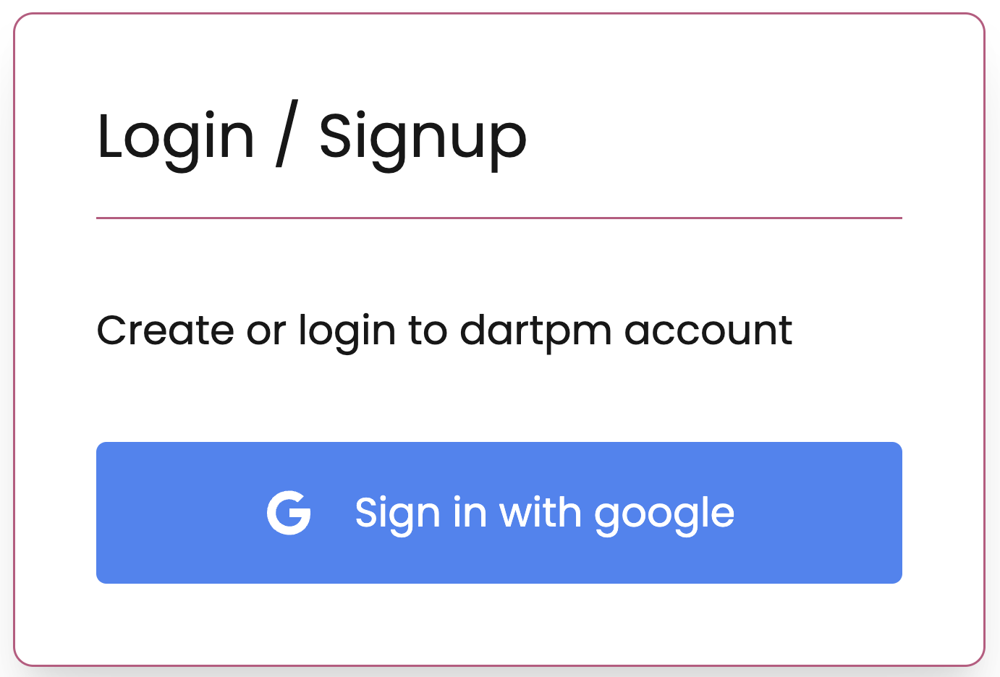
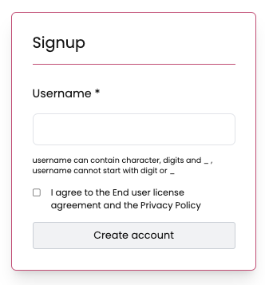
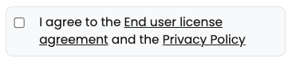

If you do not already have a dartpm user account, you can create an account in order to share and download Dart and Flutter packages on the public registry.

## Creating an account on the website

1. Go to the [dartpm login page](https://dartpm.com/login)

2. Use single sign on to login/signup on dartpm



3. Add username in the next step, the username that will be displayed when you publish packages or interact with other dartpm users on dartpm.com. Your username must be lower case, and can contain underscore and numerals. Username cannot start with number or underscore



4. Read the [End User License Agreement](#) and [Privacy Policy](#), and indicate that you agree to them.



5. Click **Create An Account**.

## Testing your new account with dartpm cli login

Install dartpm cli tool using dart cli tool

```
dart pub global activate --source hosted --hosted-url "http://dartpm.com" dartpm
```

Use the `dartpm login` command to test logging in to your new account.

Learn more about [dartpm cli tool](#)
