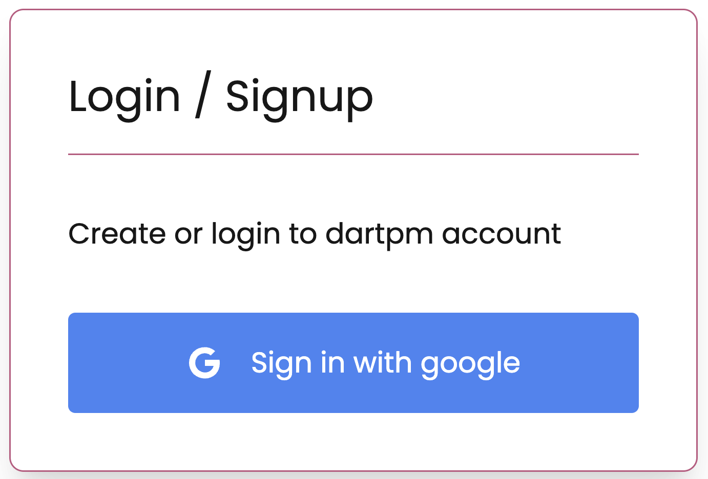
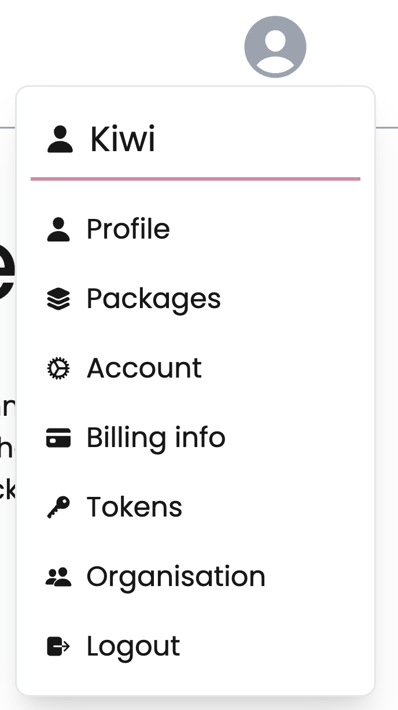

From the web, you can change the following user profile settings:

- Profile picture
- Delete account

1. On the dartpm ["Sign In"](https://dartpm.com/login) page, enter your account details and click Sign In.

2. In the upper right corner of the page, click your profile picture, then click Account.

### Change profile picture

Coming soon

### Delete account

