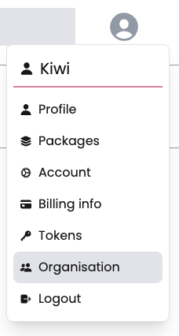

Any npm user can create an organization to manage contributor access to packages governed by the organization.

1. [Create new account](/docs/getting-started/creating-new-user.md).

2. In the upper right corner of the page, click your profile picture, then click Organisation.

3. If no org is present then this will prompt to create new org

4. If you already have orgs then you will see the add org button below the orgs

5. Enter your unique organisation name and create org.

