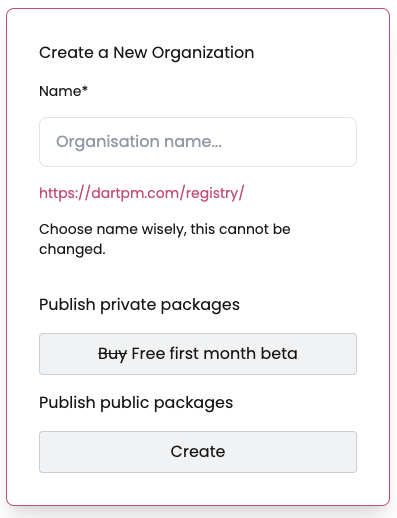

import loginSignupImg from './img/login-signup.png';
import accountDropdown from './img/account-dropdown.png';

Any npm user can create an organization to manage contributor access to packages governed by the organization.

1. Go to the [dartpm login page](https://dartpm.com/login)

2. In the upper right corner of the page, click your profile picture, then click Account.

3. In the left sidebar, click the add icon infront of organization.

4. If you already have orgs then you will see the add org button below the orgs

5. Enter your unique organisation name and create org.

